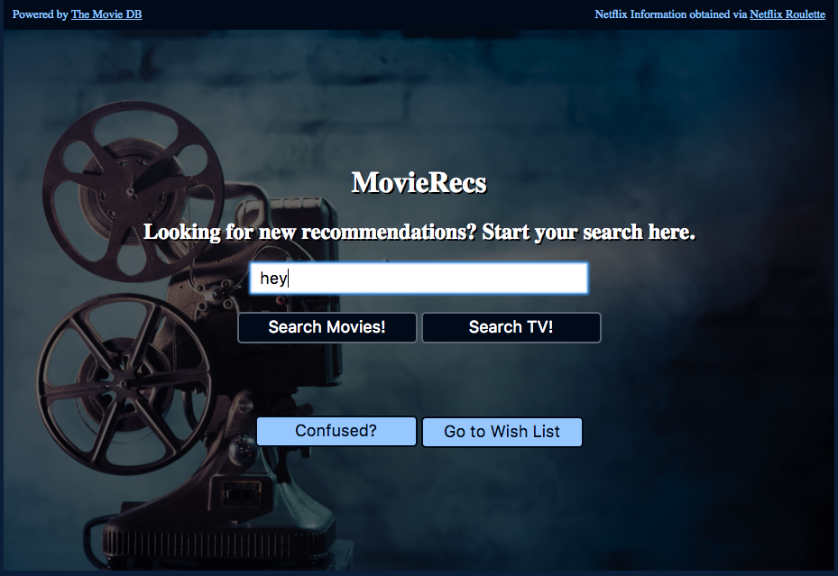
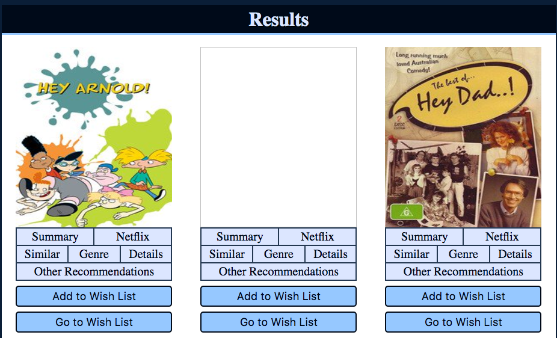
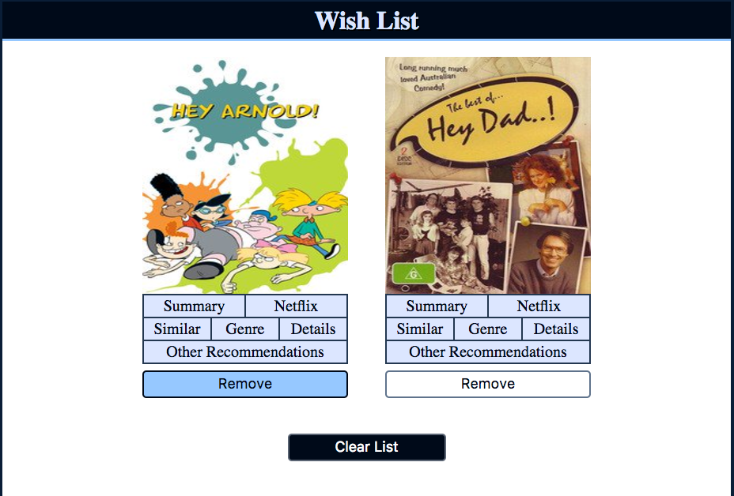
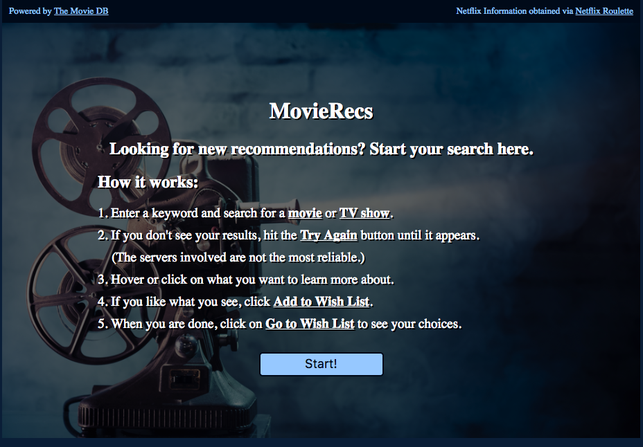

# [MovieRecs](https://jaredryan.github.io/capstone-start/)

## Description
Search for TV shows or movies to find recommendations based off them, learn more about them, and see availability on Netflix.

## Table of Contents

  - [Summary](#summary)
  - [Files](#files)  
  - [How the Application Works](#how-the-application-works)
  - [How to Use the Application](#how-to-use-the-application)
  - [Credits](#credits)
    - [Resources Used](#resources-used)
    - [Technologies Used](#technologies-used)

### Summary

This app uses an API from [The Movie Database](https://www.themoviedb.org/documentation/api) and an API from [Netflix Roulette](https://netflixroulette.net/api/). It performs a search for a movie or for a TV using the appropriate method of the API from The Movie Database. Upon retrieving movies or TV shows, it performs additional queries within the The Movie Database and Netflix Roulette to gather mre information about the movie or TV show. It then displays 20 of these results within the "Results" portion of the application.

An essential part of the application is that it also keeps a running "Wish List". When the results are displayed, one may select to add them to the "Wish List", which is displayed at the bottom of the application. This helps the user to look through the movies and keep track of the ones they want to look at later.

An explanation on how to use the application, as well as various navigational and display-altering buttons, are included for the user's convenience.

### Files

The following files are contained within one [folder](https://github.com/jaredryan/capstone-start):

  - [README.md](https://github.com/jaredryan/capstone-start/blob/master/README.md)
  - [index.html](https://github.com/jaredryan/capstone-start/blob/master/index.html)
  - [main.css](https://github.com/jaredryan/capstone-start/blob/master/main.css)
  - [app.js](https://github.com/jaredryan/capstone-start/blob/master/app.js)
  - [favicon.ico](https://github.com/jaredryan/capstone-start/blob/master/favicon.ico)
  
### How the Application Works

This application employs the heavy use of JavaScript to function. It also makes extensive use of the [API](https://developers.themoviedb.org/3/getting-started) from The Movie Database. The starting point is https://api.themoviedb.org/3.

First, depending on user input, a "GET /search/movies" or "GET /search/TV" is performed, which returns a 20 element of array.
  The title of the movie, or name of the TV show, is recorded along with the appropriate ID. 
Second, using "GET /movie/id" or "GET /tv/id", the object returned contains additional details about the movie.
Third, a "GET /movie/id/similar" or "GET /tv/id/similar" query is done to retrieve an array of objects corresponding to similar movies.
Fourth, in a similarly (pun intended) fashion, a "GET /movie/id/recommendations" or "GET /tv/id/recommendations" is done to retrieve an array of objects corresponding to recommended movies. 
All of the retrieved data is inserted into a HTML template to format the data.

While the second, third, and fourth searches are happening, a fifth query is also taking place. However, it is done through the use of a second [API](https://netflixroulette.net/api/) from Netflix Roulette. It performs a search for a movie or for a TV show by using GET on http://netflixroulette.net/api/api.php with the appropriate query (with a title field with the name of the movie or TV show). A search by title is performed, and the retrieved entry's data is inserted into the HTML template.

The second, third, fourth, and fifth queries each occur 20 times, once for each of the twenty entries returned by the first query.

However, the APIs are a bit faulty, so the search is success about 70% of the time. As such, a "Try Again" button was incorporated to allow the user to perform the same query until it is successful.

JavaScript powers the rest of the application. The most notable feature is the Wish List. It's entries are added to when specificied by the user, at which point, JavaScript takes the values associated with one result item, copies them into an HTML template similar to that used by the result item, and displays it. 

Other JavaScript functions are mostly there for the convenience of the user, such as an explanation of how to use the app that you can toggle on or off by clicking the "Confused?" button, buttons that take you to the part of the application that you want to go to, a "Clear List" button to clear all entries on the Wish List, and a "New Search" button that clears the results page and guides you to the search bar.

### How to Use the Application

It can be broken into the following steps:
1. Read the instructions (if needed) and press Start to begin, which brings up the search bar.

2. Enter a keyword. The keyword entered should be associated with the title a movie or TV show for best results.

3. Press the "Search Movies!" or "Search TV!" button to perform a search.
4. If you don't see your results, hit the Try Again button until it appears (the servers involved are not the most reliable, with a success rate of about 70% as I developed this application). Waitng a second or two in between each successive attempt is recommended.
  The results should consist of a movie poster, a few small buttons below it, and two larger buttons below it.
5. Hover or touch the small buttons to learn more about that particular topic. The topics are: Summary, Netflix, Similar, Genre, Details, and Recommended.
  Summary: contains title and description of the result.
  Netflix: gives rating on Netflix Roulette (which gets its data from Netflix) and availability on Netflix Roulette (which is closely tied with Netflix itself, hence the title of the button is simply Netflix).
  Similar: contains a list of similar movies.
  Genre: contains a list of genre(s) that apply to the movie.
  Details: depending on whether the result is a movie or TV show, it includes details such as runtime or episode length, number of seasons, airtime or release data, and popularity.
6. If you like what you see, on that result item, click the button "Add to Wish List". This will add this result's data into the Wish List in an identical format. 
7. To see more results, click the "Next" button at the end of the "Results" section; to scroll back, click "Previous". Altenatively, click "New Search" to perform a new search.
8. When you are satisfied with your choices, click any of the "Go to Wish List" buttons, found by the search bar or under each result item; or, alternatively, scroll to the bottom of the page.
9. Now that you are at your Wish List, delete any undesirable entries by clicking the "Remove" button under the result item you wish to remove, or the "Clear List" button to start over. Click "New Search" if you wish to make a new search (or scroll to the top of the page) or "Go to Results" (or scroll to the middle of the page) to look for more entries to your list. Make your Wish List exactly how you want it for your convenience.
10. Have fun! If you ever get lost, click the "Confused?" button at the top of the page to display the application's instructions once more.

### Credits

#### Resources Used
  - [The Movie Database](https://www.themoviedb.org/) and 
  - [Netflix Roulette](https://netflixroulette.net/), for having Public APIs for developers to use. 
  - [Thinkful](https://www.thinkful.com/), whose Frontend Web Development course gave me the skills to do this project.

#### Technologies Used
  - HTML
  - CSS
  - JavaScript
